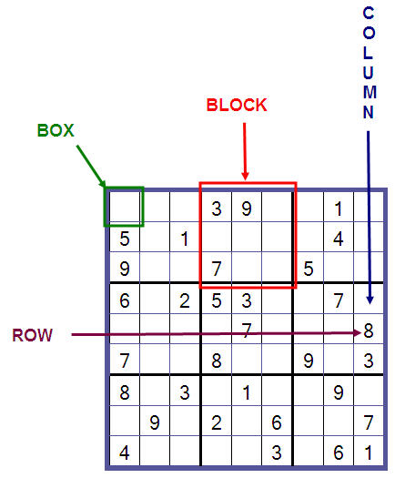
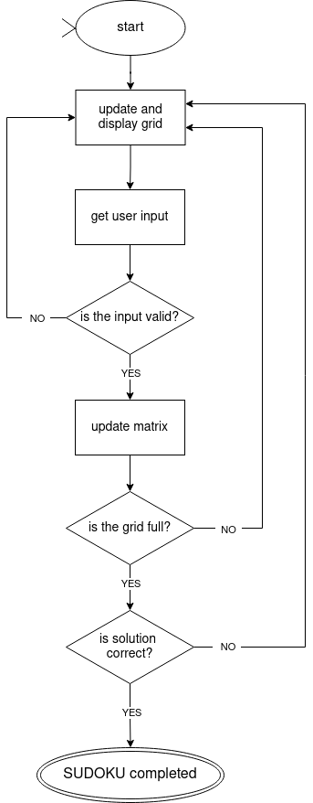

# Sudoku game
## setting up the environment (Linux)
In a terminal run the following command to clone the repository.
~~~
git clone https://github.com/ostifede02/sudoku.git
~~~
then run the following command to start the game (just for Linux users)
~~~
cd sudoku/script/
python3 game.py
~~~

## game rules
+ **Rows:** Each row must contain all the digits from 1 to 9 without repetition.

+ **Columns:** Each column must contain all the digits from 1 to 9 without repetition.

+ **Blocks:** Each of the nine 3x3 subgrids must contain all the digits from 1 to 9 without repetition.

## script structure
### finite state machine
The code is structured with a finite state machine. The flow chart below gives a better understanding on how it has been done.

### class Sudoku
All the necessary methods and attributes to operate the Sudoku game are encapsulated within the Sudoku class. Each section of the chart is defined by a specific function within this class.

### levels
Moreover, the user has the option to select from three distinct difficulty levels:
+ easy (just to test the program)
+ intermediate
+ hard

## sources
Chat-GPT has been employed for displaying formatted text on the terminal and implementing the logic to verify the correctness of a Sudoku solution.